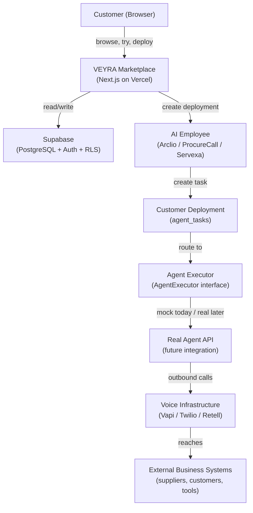
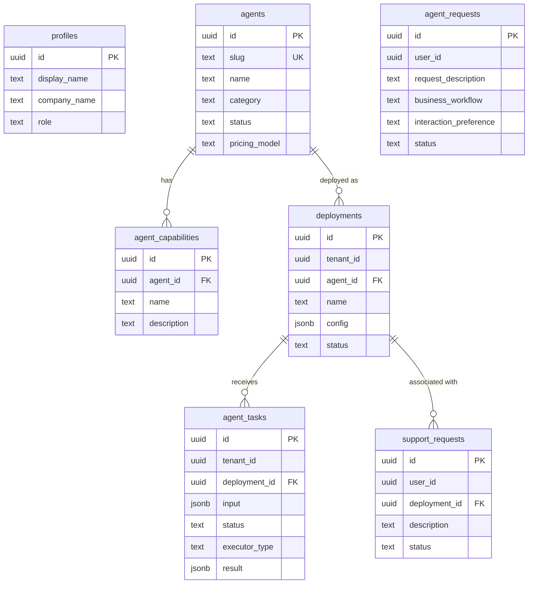
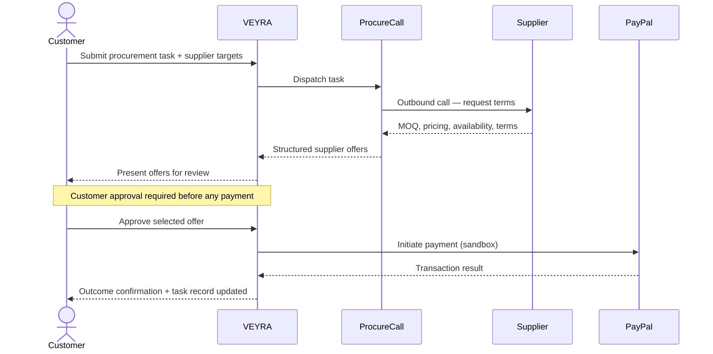

# VEYRA™

> AI employees for your business.

**Find an AI employee. Try it. Put it to work.**

VEYRA is a marketplace and deployment layer for AI employees and voice agents that can perform real business work. Customers browse available AI employees, try them, deploy their own instance, and give them tasks to execute.

---

> **Current build: Agentic Commerce**
>
> VEYRA is being extended so AI employees can move beyond completing operational tasks and participate in customer-approved commerce workflows using PayPal. This is the focus of the 2026 PayPal AI Hackathon work documented in this repository.

---

## The Product

The customer experience is designed to be minimal and direct:

```
Find an AI employee
→ Try it (demo execution, no configuration required)
→ Deploy it (short agent-specific setup)
→ Put it to work (submit tasks, receive structured results)
```

Supporting flows:

- **Request an AI employee** — customers who cannot find the right employee can submit a request for a custom build
- **Get human help** — any point in the flow has a human assistance escape hatch for customers who need support

VEYRA is designed as a distribution, deployment, and orchestration layer. It does not rebuild AI employees from scratch — it provides the customer experience, deployment infrastructure, task system, and result delivery on top of real (or future real) agent implementations.

---

## Current AI Employees

### Arclio

General-purpose AI business operator.

Arclio receives a business task from the customer, determines what needs to happen, plans a set of actions, executes those actions through connected systems and tools, verifies the result, and reports back.

**Core loop:**

```
Talk → Understand → Plan → Act → Verify → Report
```

Arclio is designed for everyday business operations: information gathering, drafting, organisation, and connected-tool execution once integrations are authorised.

---

### ProcureCall

AI procurement representative.

ProcureCall makes outbound calls to suppliers on behalf of the business and gathers structured procurement data including:

- Minimum order quantity (MOQ)
- Unit pricing
- Availability and lead times
- Delivery terms
- Payment terms

Results are returned to the customer in a structured format for review and decision-making.

---

### Servexa

Business service voice agent.

Servexa makes outbound calls to customers for business service workflows such as:

- Loan recovery and follow-up
- Payment confirmation
- Payment schedule arrangement
- Customer check-ins
- Customer service outreach

Servexa handles the conversation, captures the outcome, and returns a structured result per customer contacted.

---

## Platform Foundation

The current VEYRA foundation includes:

- Database-backed AI employee marketplace
- Agent catalogue with capability listings
- Agent detail pages
- Try experience (task preview with demo execution)
- Customer deployment flow (agent-specific setup wizard)
- Customer AI employee workspace (task submission and result display)
- Agent task system with status tracking
- Request-an-AI-employee flow (stored in Supabase with RLS)
- Human support and help request flow
- Agent executor abstraction (`AgentExecutor` interface)
- Mock executors for Arclio, ProcureCall, and Servexa

> The current mock executors are development implementations. They do not represent live supplier calls, customer calls, or real financial transactions. Mock results are clearly labelled in the UI as simulated/demo output.

---

## Architecture



**Architectural principles:**

- **Agent definitions are reusable.** One agent row in the database is shared by all customer deployments of that agent.
- **Deployments are customer-specific.** Each deployment holds the customer's configuration and task history.
- **Marketplace and voice infrastructure are separate concerns.** VEYRA is not coupled to any single voice provider.
- **Agent behaviour is data-driven.** The registry in `lib/agents/registry.ts` defines each agent's UI, config fields, and task schema — no agent logic is scattered through page code.
- **Agent executors are swappable.** `getExecutor(slug)` returns the registered executor. Swapping mock for real requires changing one entry — no other code changes.
- **Customer data is isolated.** Supabase Row Level Security enforces `tenant_id = auth.uid()` on every authenticated table.
- **Additional AI employees can be added** without redesigning the marketplace, routes, or deployment infrastructure.

---

## Data Model



**Key relationships:**

- An `agent` is a reusable product definition. A `deployment` is one customer's instance of that agent.
- `agent_tasks` record every unit of work submitted through a deployment, including input, status, and structured result.
- `agent_requests` and `support_requests` are customer-initiated flows stored with user-level RLS.
- `executor_type` on every task is always explicit — `'mock'` or `'real'` — so the origin of every result is unambiguous.

---

---

# PayPal AI Hackathon — Agentic Commerce

The next stage of VEYRA is to give AI employees the ability to participate in real commerce workflows.

An AI employee should not stop after gathering information or making a recommendation. It should be able to carry the workflow forward into a customer-approved transaction.

> For the PayPal AI Hackathon, VEYRA is extending its existing AI employee platform with an agentic-commerce workflow powered by PayPal.

---

## The ProcureCall Commerce Flow

ProcureCall is the lead agent for the hackathon build. Its existing capability — contacting suppliers and gathering structured procurement data — creates a natural foundation for a commerce workflow.

```
Customer submits procurement task
↓
VEYRA routes to ProcureCall
↓
ProcureCall contacts suppliers (outbound calls)
↓
Collects: MOQ / pricing / availability / delivery terms / payment terms
↓
Structured supplier offers returned to VEYRA
↓
VEYRA presents results to customer
↓
Customer reviews offers
↓
Customer explicitly approves a transaction
↓
PayPal processes the payment (sandbox)
↓
Transaction result recorded in VEYRA
↓
Customer receives outcome
```

**The intent:**

ProcureCall performs the operational procurement work first. The customer remains in full control of the financial decision. PayPal handles the payment step only after explicit customer approval. This demonstrates an AI employee moving from *"do the work"* to *"complete the workflow."*

---

## PayPal Integration — Sequence



Customer approval occurs explicitly before any payment operation is initiated.

---

## Why PayPal

PayPal is not being added as a generic checkout button. The intent is to connect PayPal directly to the work performed by the AI employee — closing the loop between operational AI work and a verified payment.

**The value chain:**

```
AI understands the task
→ AI performs procurement work
→ AI gathers supplier information
→ Customer approves the resulting transaction
→ PayPal executes the payment
→ VEYRA records the outcome
```

PayPal provides AI-oriented developer tooling including an Agent Toolkit and MCP server, which will be evaluated as part of the hackathon implementation.

---

## Trust and Human Control

The intended trust model for the agentic-commerce workflow:

- AI employees can perform operational work autonomously.
- Financial actions require **explicit customer approval** — no payment is initiated without a customer action.
- PayPal sandbox is used during development; no real money is moved in the hackathon build.
- VEYRA does not store customer payment credentials.
- Secrets are held in environment variables and never committed to the repository.
- Supabase Row Level Security isolates all customer data at the database layer.
- Every financial action is intended to be auditable via `agent_tasks` records.
- The customer remains the final authority over payment.

---

## Current Status

| Area | Status |
|---|---|
| VEYRA marketplace foundation | Built |
| Agent catalogue | Built |
| Agent deployment flow | Built |
| Customer AI employee workspace | Built |
| Mock agent execution | Built |
| Request an AI employee | Built |
| Human help flow | Built |
| Real Arclio API integration | In progress |
| Real ProcureCall API integration | In progress |
| Real Servexa API integration | In progress |
| PayPal sandbox integration | Hackathon build |
| Agentic commerce workflow | Hackathon build |
| Customer-approved payment flow | Hackathon build |
| Voice command centre | Planned |
| Expanded AI employee marketplace | Planned |

---

## Tech Stack

| Layer | Technologies |
|---|---|
| Frontend | Next.js 15 (App Router), TypeScript, React |
| Styling | Tailwind CSS, custom design tokens |
| Icons | Lucide |
| UI primitives | Hand-rolled components (`components/ui/`) |
| Backend | Supabase — PostgreSQL, Auth, Storage, Edge Functions |
| Deployment | Vercel |
| Development tooling | Git, GitHub, IBM Bob (AI-assisted engineering) |

---

## Project Structure

```
app/
├── agents/              Agent catalogue and detail pages
│   └── [slug]/          Individual agent page (Try + Deploy)
├── deploy/
│   └── [agentSlug]/
│       └── setup/       Deployment setup wizard
├── my-employees/        Customer AI employee dashboard
│   └── [id]/            Individual deployment workspace
├── auth/callback/       Supabase auth callback
├── dashboard/           Redirects to /my-employees
└── login/               Authentication page

components/
├── ui/                  Design-system primitives (Button, Card, Badge)
├── results/             Agent-specific result renderers
└── ...                  Shared layout and modal components

lib/
├── agents/
│   ├── executor.ts      AgentExecutor interface + mock executors
│   └── registry.ts      Per-agent metadata, config/task schemas
├── actions/
│   └── deployment.ts    Server actions (create deployment, submit task, etc.)
└── supabase/            Browser/server clients, database types, query helpers

supabase/
└── migrations/
    ├── 0001_initial_schema.sql
    ├── 0002_seed_agents.sql       (idempotent)
    ├── 0003_deployment_experience.sql
    └── 0004_deduplicate_capabilities.sql
```

---

## Development

**Install dependencies:**

```bash
npm install
```

**Run locally:**

```bash
npm run dev
```

Visit [http://localhost:3000](http://localhost:3000).

**Validate:**

```bash
npx tsc --noEmit
npm run build
```

**Required environment variables** — copy `.env.local.example` to `.env.local` and fill in:

```
NEXT_PUBLIC_SUPABASE_URL=https://<project-ref>.supabase.co
NEXT_PUBLIC_SUPABASE_PUBLISHABLE_KEY=<your-publishable-anon-key>
```

See [`.env.local.example`](.env.local.example) for the full reference.

**Database migrations** — apply in order via Supabase Dashboard → SQL Editor or `supabase db push`:

```
supabase/migrations/0001_initial_schema.sql
supabase/migrations/0002_seed_agents.sql
supabase/migrations/0003_deployment_experience.sql
supabase/migrations/0004_deduplicate_capabilities.sql
```

---

## Roadmap

```
[x] VEYRA marketplace foundation
[x] Database-backed agent catalogue
[x] Agent detail pages with capability listings
[x] Try experience (demo execution)
[x] Customer deployment architecture
[x] Customer AI employee workspace
[x] Mock agent execution (Arclio, ProcureCall, Servexa)
[x] Request an AI employee
[x] Human help flow

[ ] Real Arclio API integration
[ ] Real ProcureCall API integration
[ ] Real Servexa API integration
[ ] PayPal sandbox integration
[ ] Agentic commerce workflow
[ ] Customer-approved payment flow
[ ] Voice command centre
[ ] Production commerce workflow
[ ] Expanded AI employee marketplace
```

---

## AI-Assisted Development

> VEYRA is developed with AI-assisted engineering tools, including IBM Bob and other AI development tools. AI assistance is used for implementation, debugging, architecture iteration, and documentation, while the project architecture, product direction, integrations, and final engineering decisions are maintained by the project creator.

---

## License

License information will be added before public release.
